捷联式惯性导航原理 
=============================

[^参考书目：]: 《捷联式惯性导航原理》（袁信，郑锷）

# 基本概念

## 惯性导航的基本原理

### 导航的基本概念

- **导航** 就是正确引导 **航行体** 沿着 **预定轨道** **在规定时间内** 到达目的地
- **导航系统** 只提供 **导航参数（任意时刻航行体的地理位置、航行速度、航行体的姿态、航向等）**，不直接参与对导航体的控制。导航系统是一个开环系统，也是一个信息处理系统，即把导航仪表测得的航行信息处理成各种需要的导航参数。**导航系统 + 自动驾驶系统** 才是一个完整的闭环系统，称为 **导航自动控制系统**
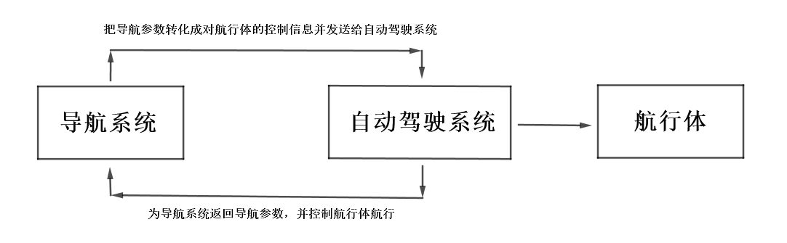

### 惯性导航的工作原理
- **惯性导航** 是一种自主式的导航方法，完全依靠机载设备自主地完成导航任务，不与外界发生光、电等联系，隐蔽性好，不受气象条件限制，用于军事领域（导弹、舰船、飞机、宇宙航行器）。

- 惯性导航的工作原理基于 **牛顿力学**，航行体内用导航加速度表测量飞行器的加速度，并以此积分求得导航器的速度、位置。飞行器的瞬时位置由坐标 $x,y$ 来表示，在飞行器内用一个导航平台把两个导航加速度计的测量轴分别固定在 $x$ 和 $y$ 方向，则飞行器的瞬时速度和瞬时位置可由下式求得：
  $$
  v_x(t)=v_x(0)+\int_0^t a_x{\rm d}{\tau}\\
  v_y(t)=v_y(0)+\int_0^t a_y{\rm d}{\tau}\\
  x(t)=x(0)+\int_0^t v_x{\rm d}{\tau}\\
  y(t)=y(0)+\int_0^t v_y{\rm d}{\tau}
  $$
  其中 $a_x, a_y$ 由两个加速度计测得。

- 实际的惯性导航中，用经纬度 $\lambda$ 和 $\varphi$ 来表示飞行器的地理位置，如果 $x$ 指向北，$y$ 指向东，则经纬度表示为：
  $$
  \varphi(t)=\varphi_0+\frac1R\int_0^tv_x{\rm d}\tau\\
  \lambda(t)=\lambda_0+\frac1{R\cos\varphi(t)}\int_0^tv_y{\rm d}\tau
  $$
   其中 $R$ 为地球半径。

- 导航加速度计的测量范围为 $10^{-6}g$ 到 $10^{-9}g$, 分辨率要 $10^{-6}g$, 陀螺漂移要在 $0.01$度/小时 到 $0.001$度/小时，导航平台的水平精度要在 $10$ 到 $20$ 角秒。
### 导航中常用的坐标系
- **地心惯性坐标系（$i$ 系，$x_i,y_i,z_i$ 轴）**，原点在地球中心，$z_i$ 轴沿地球自转方向，$x_i,y_i$ 轴在赤道平面内，指向恒星方向，$x_i,y_i,z_i$ 形成右手坐标系，并且固定不动。该坐标系是惯性仪表测量的参考标准。
- **地球坐标系（$e$ 系，$x_e,y_e,z_e$ 坐标轴）**，原点在地球中心，$z_e$ 轴与地球自转轴重合，$x_e$ 轴在赤道平面内指向格林威治子午线，$y_e$ 轴在赤道平面内，$x_e,y_e,z_e$ 形成右手坐标系。该坐标系与地球固连，相对于地心惯性坐标系的运动就是地球的自转速度 $\omega$。
- **地理坐标系（$n$ 系，NED 坐标轴）**，原点在飞行器中心，N 轴指北，E 轴指东，D 轴和重力 $g$ 方向一致，也叫 **北东地坐标系**，地理坐标系也可以取 **东北天**、**北西天**坐标系。
- **机体坐标系（$b$ 系，$x_b,y_b,z_b$ 坐标轴）**，与飞行器固连，原点在飞行器中心，$x_b$ 轴沿飞行器纵轴方向，$y_b$ 轴和飞行器的横轴方向一致，$z_b$ 轴沿飞行器竖轴向下，$x_b,y_b,z_b$ 轴形成右手坐标系。机体坐标系相对于地理坐标系的方位为飞行器的姿态和航向。
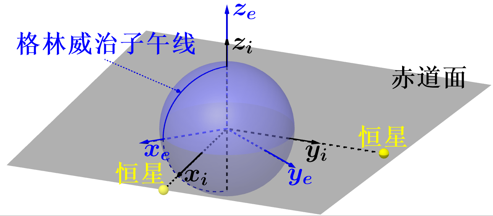
## 飞行器的位置、姿态、航向的确定
- 导航参数：
  - 飞行器瞬时地理位置、瞬时速度
  - 飞行器的姿态，航向
  - 偏流角
  - 已飞距离、待飞距离
  - 航迹角
  - $\cdots$
- **当用经纬度表示飞行器地理位置时，地理位置就是地理坐标系（n 系）和地球坐标系之间的方位关系**
从地球坐标系（$e$ 系）到地理坐标系（$n$ 系的变换矩阵位）：
$$
\begin{pmatrix}
N \\
E \\
D
\end{pmatrix}
=
C_e^n
\begin{pmatrix}
x_e \\
y_e \\
z_e
\end{pmatrix}
$$
其中 **变换矩阵（也叫位置矩阵）** $C_e^n$ 为
$$
\begin{pmatrix}
c_{11} & c_{12} & c_{13} \\
c_{21} & c_{22} & c_{23} \\
c_{31} & c_{32} & c_{33}
\end{pmatrix}
=
\begin{pmatrix}
-\sin\varphi\cos\lambda & -\sin\varphi\sin\lambda & \cos\varphi \\
-\sin\lambda & \cos\lambda & 0 \\
-\cos\varphi\cos\lambda & -\cos\varphi\sin\lambda & -\sin\varphi
\end{pmatrix}
$$
其中 $\lambda$ 和 $\varphi$ 即为飞行器的地理坐标（**经纬度**）。该变换包含了一个 $x_e,y_e$ 平面内绕 $z_e$ 轴 $\lambda$ 角度的转动得到 $x'_e,y'_e,z'_e$，和绕 $y'_e$ 轴 $90^{\circ}+\varphi$ 的转动。（**注意：两步转动操作并不能完全得到$n$系，因为两坐标系的原点不重合，需要一个平移，但是仅靠转动操作足以求出$\lambda$ 和 $\varphi$**）
在飞行器飞行的过程中，如果能实时地知道 $c_{ij}$，则可由下式实时地知道飞行器的地理坐标：
$$
\varphi=-\sin^{-1}c_{33}\\
\lambda=\tan^{-1}\frac{c_{32}}{c_{31}}
$$
惯性导航就是在飞行器飞行过程中实时计算 $C_e^n$ 中的各个元素。

- **飞行器的姿态和航向就是机体坐标系（$b$ 系）和地理坐标系（$n$ 系）之间的方位关系**
    - **航向角：** 飞行器 $x_b$ 轴与地理北向的夹角($\psi\in[0^\circ,360^\circ)$)，描述飞行器绕 $D$ 轴的转动；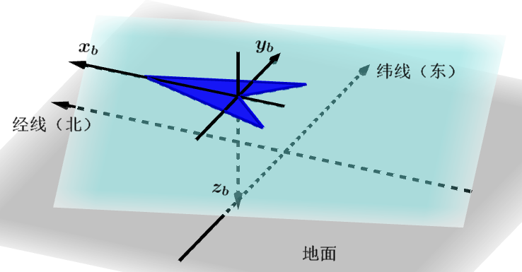

      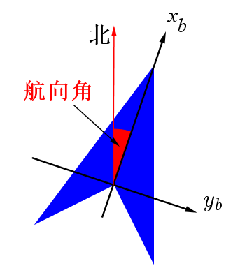

    - **俯仰角：** 飞行器 $x_b$ 轴与水平面（或纵向水平轴）的夹角($\theta\in[-90^\circ,90^\circ]$)，描述飞行器绕横向水平轴 $E$ 的转动，向上为正，向下为负；

      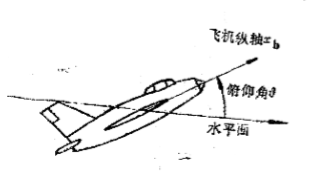

    - **倾斜角：** 飞行器纵向对称平面（$x_b,z_b$轴构成的平面）与纵向铅锤平面（$x_b,D$轴构成的平面）的夹角($\gamma\in[-180^\circ,180^\circ]$)，描述飞行器绕 $x_b$ 轴的转动，右倾为正，左倾为负。

      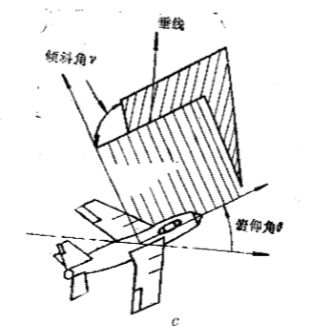

- 变换矩阵 $C_n^b$ 为：
$$
\begin{pmatrix}
\cos\psi\cos\theta & \sin\psi\cos\theta & -\sin\theta \\
\cos\psi\sin\theta\sin\gamma-\sin\psi\cos\gamma & \sin\psi\sin\theta\sin\gamma+\cos\psi\cos\gamma & \cos\theta\sin\gamma \\
\cos\psi\sin\theta\cos\gamma+\sin\psi\sin\gamma & \sin\psi\sin\theta\cos\gamma-\cos\psi\sin\gamma &
\cos\theta\cos\gamma
\end{pmatrix}=(T_{ij})
$$
- 如果知道了变换矩阵 $C_n^b$ （也叫 **姿态矩阵**） 的各个元素，就可以通过下式得到飞行器的姿态和航向角：
$$
\psi=\tan^{-1}\frac{T_{12}}{T_{11}}\\
\theta=-\sin^{-1}T_{13}\\
\gamma=\tan^{-1}\frac{T_{23}}{T_{33}}
$$
- 在平台式惯性导航系统中，地理坐标系和是可以由平台实验体模拟的，即可以由几何关系测得姿态角和航向角，并不需要实时计算，但是在捷联式惯性导航系统中，由于没有实验平台，必须实时计算姿态矩阵，并从中获取飞行器姿态和航向信息，这是一个难题（飞行器姿态变化速率太快）。

## 捷联式惯导和平台式惯导的主要区别
捷联式和平台式惯导的主要区别是前者采用数字导航平台，用以计算姿态矩阵和其他导航参数，加速度计和陀螺仪安装在飞行器机体上，后者采用平台导航系统，直接测量姿态角和航向角。
# 捷联式惯导的基本算法
## 捷联式惯导算法概述
捷联式惯性导航系统是一个信息处理系统，就是把机体安装的惯性仪表所测量的飞行器运动信息，经过计算机处理成所需要的导航和控制信息。所谓“捷联式惯性导航算法”就是指 **从惯性仪表的输出到给出需要的导航和控制信息所必须进行的全部计算问题的计算方法。** 计算的内容和要求，根据应用和功能的不同有很大的差别，一般来说，捷联式惯导的基本算法有如下内容：
- **系统的启动和自检测：** 系统启动后，各个部分是否工作正常，要通过自检程序检测，其中包括电源、惯性仪表、计算机及计算机软件。通过自检测，发现有不正常，则发出警告。
- **系统的初始化：** 包括三项内容：
    - 给定飞行器的初始位置和初始速度等信息；
    - 导航平台的初始对准，在平台式惯导中，初始对准就是平台坐标系和导航坐标系相一致，是用物理方法来实现的，但是在捷联式惯导中，初始对准则是姿态矩阵的初始值，是用计算机程序来完成的；
    - 惯性仪表的校准，对陀螺仪的标度系数进行测定，对陀螺仪的漂移进行测定和补偿，对加速度计也进行同样的标度系数测定并存入计算机；
- **惯性仪表的误差补偿。**
- **姿态矩阵的计算。**
- **导航计算**，即把加速度计的输出信息变换到导航坐标系，并计算飞行器的导航信息。
- **制导和控制信息的提取。**
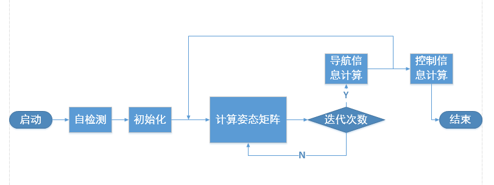

## 姿态矩阵的计算

在捷联式惯导系统中，飞行器的地理位置就是地理坐标系相对于地球坐标系的方位，而飞行器的姿态和航向就是机体坐标系相对于地理坐标系的方位。确定两坐标系方位关系的问题，即刚体定点转动理论：**三参数法（欧拉角法）、四参数法（四元数法、凯里-克莱因参数法）、九参数法（方向余弦法）。**姿态矩阵和位置矩阵都可以用上述方法来计算，这一节主要介绍姿态矩阵的计算方法。

### 欧拉角法

一个动坐标系相对于参考坐标系的方位，可以完全由动坐标系依次绕三个不同转轴的转动角来确定。在姿态矩阵问题中，$b$ 系 $(x_b,y_b,z_b)$ 是动坐标系，$n$ 系 $(N,D,E)$ 是参考坐标系，则航向角 $\psi$，俯仰角 $\theta$ 和倾斜角 $\gamma$ 就是一组欧拉角。

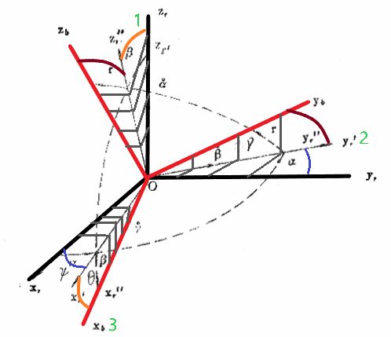

欧拉角的选择共有 $N=3\times2\times2=12$ 种。

#### 欧拉角表示姿态矩阵

假设初始时刻，$(x_{b_0},y_{b_0},z_{b_0})$ 与 $(N,E,D)$ 重合，第一次转动是动坐标系 $(x_{b_0},y_{b_0},z_{b_0})$ 绕 $z_{b_0}$ 轴转动 $\psi$ 角，即为飞行器的航向角，得到 $(x'_b,y'_b,z'_b)$，从 $(N,E,D)$ 系到 $(x'_b,y'_b,z'_b)$ 系的变换关系为
$$
\begin{pmatrix}
x'_b \\ y'_b \\z'_b
\end{pmatrix}=
C_{\psi}
\begin{pmatrix}
N \\ E \\ D
\end{pmatrix}=
\begin{pmatrix}
\cos\psi & \sin\psi & 0 \\
-\sin\psi & \cos\psi & 0\\
0 & 0& 1
\end{pmatrix}
\begin{pmatrix}
N \\ E \\ D
\end{pmatrix}
$$
第二次转动是 $(x'_b,y'_b,z'_b)$ 绕 $y'_b$ 轴（即飞行器的水平横轴）旋转 $\theta$ 角，即为飞行器的俯仰角，得到 $(x''_b,y''_b,z''_b)$ ，从 $(x'_b,y'_b,z'_b)$ 到 $(x''_b,y''_b,z''_b)$ 的变换关系为
$$
\begin{pmatrix}
x''_b \\ y''_b \\z''_b
\end{pmatrix}=
C_{\theta}
\begin{pmatrix}
x'_b \\ y'_b \\ z'_b
\end{pmatrix}=
\begin{pmatrix}
\cos\theta & 0  & -\sin\theta \\
0 & 1 & 0\\
-\sin\theta & 0 & \cos\theta
\end{pmatrix}
\begin{pmatrix}
x'_b \\ y'_b \\ z'_b
\end{pmatrix}
$$
第三次转动是 $(x''_b,y''_b,z''_b)$ 绕 $x''_b$ 轴（即飞行器的水平纵轴）旋转 $\gamma$ 角，即为飞行器的倾斜角，得到 $(x_b,y_b,z_b)$，从 $(x''_b,y''_b,z''_b)$ 到 $(x_b,y_b,z_b)$ 的变换关系为
$$
\begin{pmatrix}
x_b \\ y_b \\z_b
\end{pmatrix}=
C_{\gamma}
\begin{pmatrix}
x''_b \\ y''_b \\ z''_b
\end{pmatrix}=
\begin{pmatrix}
1 & 0  & 0 \\
0 & \cos\gamma & \sin\gamma\\
0 & -\sin\gamma & \cos\gamma
\end{pmatrix}
\begin{pmatrix}
x''_b \\ y''_b \\ z''_b
\end{pmatrix}
$$
将上述三个式子连乘得到地理坐标系到机体坐标系的变换矩阵（即 **姿态矩阵**）$C_n^b=C_{\gamma}C_{\theta}C_{\psi}$
$$
C_n^b=
\begin{pmatrix}
\cos\psi\cos\theta & \sin\psi\cos\theta & -\sin\theta \\
\cos\psi\sin\theta\sin\gamma-\sin\psi\cos\gamma & \sin\psi\sin\theta\sin\gamma+\cos\psi\cos\gamma & \cos\theta\sin\gamma \\
\cos\psi\sin\theta\cos\gamma+\sin\psi\sin\gamma & \sin\psi\sin\theta\cos\gamma-\cos\psi\sin\gamma &
\cos\theta\cos\gamma
\end{pmatrix}
$$
**皮欧符号法则**

####  欧拉角微分方程

用 $\boldsymbol{\omega_n^b}$ 表示机体坐标系相对于地理坐标系的角速度矢量在机体坐标系轴向的分量构成的列矩阵，为了求出欧拉角的微分方程，我们来看看 $\dot\psi, \dot\theta, \dot\gamma$ 的物理意义，首先，$\dot\psi$ 是在 $(x'_b, y'_b, z'_b)$ 坐标系中飞行器的航向角速度矢量，也是飞行器角速度矢量在 $(b')$ 系中的 $z'_b$ 分量 ${\omega'_b}^z$，变换到 $(x_b,y_b,z_b)$ 坐标系中需经过两次变换，即
$$
\begin{pmatrix}
0 \\ 0 \\
{\omega_n^b}_{bz}
\end{pmatrix}=
C_{\gamma}C_{\theta}
\begin{pmatrix}
0 \\ 0 \\ {\omega'_b}^z
\end{pmatrix}
$$
$\dot\theta$ 是在 $(b'')$ 系中飞行器的俯仰角速度矢量，也是飞行器角速度矢量在 $(b'')$ 中的 $y''_b$ 分量 ${\omega''_b}^y$ 分量，变换到 $(x_b,y_b,z_b)$ 坐标系中需经过一次变换，即
$$
\begin{pmatrix}
0 \\
{\omega_n^b}_{by} \\ 0
\end{pmatrix}=
C_{\gamma}
\begin{pmatrix}
0 \\ {\omega''_b}^y \\ 0
\end{pmatrix}
$$
而 $\dot\gamma$ 是在 $(b)$ 坐标系中飞行器的倾斜角速度，也是飞行器角速度矢量在 $(b)$ 系中的 $x_b$ 分量 ${\omega_n^b}_{bx}$，无序变换。因此，有
$$
\begin{pmatrix}
{\omega_n^b}_{bx} \\
{\omega_n^b}_{by} \\
{\omega_n^b}_{bz}
\end{pmatrix}=
C_{\gamma}C_{\theta}
\begin{pmatrix}
0 \\
0 \\
\dot\psi
\end{pmatrix}+
C_{\gamma}
\begin{pmatrix}
0 \\
\dot\theta \\
0
\end{pmatrix}+
\begin{pmatrix}
\dot\gamma \\
0 \\
0
\end{pmatrix}
$$
化简得
$$
\begin{pmatrix}
\dot\gamma \\ \dot\theta \\ \dot\psi
\end{pmatrix}=\frac{1}{\cos\theta}
\begin{pmatrix}
\cos\theta & -\sin\gamma\sin\theta & \cos\gamma\sin\theta \\
0 & \cos\theta\cos\gamma & -\sin\gamma\cos\theta \\
0 & \sin\gamma & \cos\gamma
\end{pmatrix}
\begin{pmatrix}
{\omega_n^b}_{bx} \\ {\omega_n^b}_{by} \\ {\omega_n^b}_{bz}
\end{pmatrix}
$$
这就是欧拉角微分方程，求解之可得航向角和姿态角，并得到姿态矩阵。其中 $\boldsymbol{\omega_n^b}$ 的三个分量由机体固连的陀螺仪测得。

### 方向余弦法

- 方向余弦表示姿态矩阵
- 方向余弦微分方程
- 矢量转动坐标变换
- 矩阵微分方程的解

### 四元数法

- 四元数的基本概念

- 矢量坐标变换的四元数表示
  $$
  \vec r'=Q\circ r Q^*\\
  \vec r=Q\circ r' Q
  $$

- 四元数和方向余弦的关系，即
  $$
  Q(R_b)=M(Q^*)M^*(Q)\bar{Q}(R_n)\\
  $$
  其中，
  $$
  Q(R_b)=[0,x_b,y_b,z_b]^T\\
  Q(R_n)=[0,x_n,b_n,z_n]^T\\
  M(Q^*)=
  \begin{pmatrix}
      q_0 & q_1 & q_2 & q_3 \\
      -q_1 & q_0 & q_3 & -q_2 \\
      -q_2 & -q_3 & q_0 & q_1\\
      -q_3 & q_2 & -q_1 & q_0\\
   \end{pmatrix}
  $$
  如果知道了四元数的四个元素，就可以知道姿态矩阵的九个元素。

- 四元数微分方程

- 四元数微分方程的解

- **等效转动矢量法**

    - 转动的不可交换性
    - 等效转动矢量微分方程

这四种方法都可以用来确定运动坐标系相对于参考坐标系的方位关系，在捷联式惯导中，既可以用来算姿态矩阵，也可以用来算位置矩阵，在实际中由于姿态矩阵的实时计算速度要快，一般采用四元数法，而位置矩阵的计算速度要慢，一般采用方向余弦法。

## 姿态矩阵计算机上的执行算法

### 增量算法

- 陀螺仪：	陀螺仪是一种 **用高速回转体的动量矩敏感壳体相对惯性空间绕正交于自转轴的一或二个轴的角运动检测装置** 用来测量角位移的器件。捷联式陀螺仪，都是采用脉冲再平衡回路，其输出是一串脉冲，每一个脉冲代表一个叫增量$\Delta\theta=\int_t^{t+\Delta t}\omega_{ib}(\tau)\rm{d}\tau$。利用该角增量直接计算姿态矩阵或姿态四元数，则叫做增量算法。增量算法一般有 **定时增量算法** 和 **固定增量算法** 两种。
- 定时增量算法：在规定的时间采样区间对陀螺仪的输出进行采样，不管角增量的大小。
- 固定增量算法：对陀螺仪输出按一定大小增量进行采样，每个陀螺仪输出到达一定增量时即被送入计算机。

### 数值积分法

用数字计算机求解微分方程的数值积分

- 一阶龙格库塔算法（Runge-Kutta）
- 二阶龙格库塔算法
- 四阶龙格库塔算法

### 姿态航向信息和角速度信息的提取

#### 姿态和航向信息的提取

#### 加速度信息提取

- 一阶（角速度视为常数）角速度提取
- 二解（角速度视为线性）角速度提取（采用四阶龙格库塔算法积分时常用）

# 捷联式惯导系统的程序编排

捷联式惯导系统中所使用的陀螺仪分为两种：一是速率陀螺仪，用来测量飞行器角速度；二是位置陀螺仪，用来测量角位置

## 用惯性坐标系的捷联式惯导系统

- 变换矩阵的计算，$C_b^i$，解四元数微分方程得到
  $$
  Q(\dot q)=\frac12M^*(\omega_b)Q(q)
  $$

- 惯性坐标系中的加速度，加速度计的输出正比于飞行器的惯性加速度与地心引力加速度之差
  $$
  \ddot R^i=C_b^if^b+G_i
  $$
  式中，$\ddot R$ 为计算的惯性加速度，$R^i$ 飞行器在惯性坐标系中的位置矢量，$G_i$ 计算的地球引力加速度

- 引力加速度的计算

- 速度的计算：飞行器相对于地球坐标系位置矢量的时间变化率 $V^e=\dot {R^e}$，地理坐标系中
  $$
  V^n=[V_N,V_E,V_D]^T=C_i^n(\dot R^i-\omega_{je}^{ik})
  $$

- 位置计算

  - 地理纬度 $\varphi$ 和地心纬度 $\varphi_c$ 的关系：
    $$
    \varphi=\varphi_c+D\\
    \varphi_D=\sin^{-1}\frac{\hat T_z}{\hat R}\\
    D\approx e\sin2\varphi \quad\text{垂线偏差}\\
    e=\frac{R_e-R_p}{R_e} \quad\text{地球椭圆度}\\
    R_p \quad\text{地球极轴半径}\\
    \hat\varphi=\sin^{-1}\frac{\hat T_z}{\hat R}+e\sin2\hat\varphi
    $$

- 姿态和航向的计算

### 用地理坐标系的捷联式惯导系统

- 姿态矩阵的计算
- 速度计算
- 重力计算
- 经纬度和高度的计算
- 垂直通道的阻尼

### 用游动方位坐标系的捷联式惯导系统

游动方位坐标系：将 $n$ 系绕 $D$ 轴 旋转 $\alpha$ 角度得到，并以 $\omega_{ie}\sin\varphi$ 的角速度绕 $z_e$ 轴转动

- 导航位置计算

  - 位置矩阵的计算，由于游动方位坐标系相对于地球的运动角速度较小，因此一般采用解矩阵微分方程的方法求解位置矩阵
    $$
    \dot C_p^e=C_p^e\omega_{eP}^{pK}
    $$
    其中，
    $$
    \omega_{eP}^{pK}=
    \begin{pmatrix}
    0 & -\omega_{epz} & \omega_{epy}\\
    \omega_{epz} & 0 & -\omega_{epx}\\
    -\omega_{epy} & \omega_{epx} & 0
    \end{pmatrix}
    $$
    其中 $\omega_{epz}=0$.

  - 经纬度和游动角的计算

- 速度计算

- 姿态和航向角的计算

- 垂直通道的三阶阻尼回路

### 用静电陀螺仪的捷联式惯导系统

经典陀螺仪可以直接测量机体坐标系相对于惯性坐标系的角位置

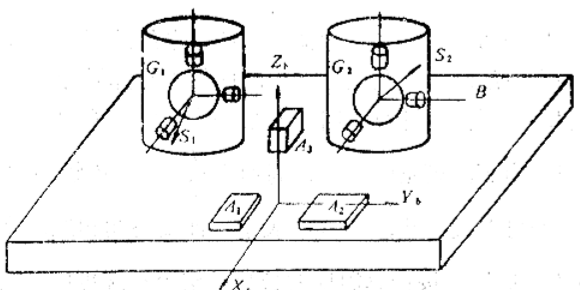

两个经典陀螺仪和三个加速度计固连在飞行器上

# 捷联惯导的误差分析

误差来源：

1. 惯性仪表的安装误差和标度因子误差；
2. 陀螺仪的漂移误差和加速度计的零位误差；
3. 初始条件误差，包括导航参数和姿态航向的初始误差；
4. 计算误差，主要考虑姿态航向系统的计算误差，也就是数学平台的计算误差；
5. 飞行器的叫运动引起的陀螺仪的动态误差

## 加速度仪表和陀螺仪的安装误差和标度误差

### 非正交变换

一个正交坐标系 $p$ 和一个非正交坐标系（各个轴不是完全正交的，有一个误差角）$a$ 之间的变换，在误差角很小的情况下，从 $p$ 到 $a$ 的变换可以写成
$$
p\to a:\quad f^a=[I+(\Delta C_a^p)^T]f^p
$$
即 $C_a^p=I+\Delta C_a^p$，其中 $\Delta C_a^p$ 代表了误差角，那么从 $a$ 到 $p$ 的变换不是 $f^p=C_a^pf^a$，而是
$$
a\to p:\quad f^p=[I-(\Delta C_a^p)^T]f^a
$$
即${C^*}_a^p=I-(\Delta C^p_a)^T$

### 安装误差

捷联式惯导的三个加速度仪和三个（或者两个）陀螺仪是直接安装在飞行器上，按照要求，惯性器件的三个输入轴应该和机体坐标系的三个轴完全一致，但实际上，在安装时总存在这误差。每个加速度计和陀螺仪输入轴的安装误差可以用两个参数来描述，此时，加速度计坐标系和陀螺仪坐标系都变成了非正交坐标系，此时加速度计和陀螺仪的变换公式为
$$
f^b=[I-(\Delta C_a^b)^T]\widetilde f^a\\
\omega^b_{i,b}=[I-(\Delta C_g^b)^T]\widetilde\omega_{i,b}^g
$$
即可消除安装误差。然而，$(\Delta C_a^b)^T$ 和 $(\Delta C_g^b)^T$ 表示加速度计和陀螺仪的安装误差角，这是做不到的。

### 标度误差

标度因子和标度误差：加速度计和陀螺仪的输出是脉冲，每一个脉冲信号代表一个速度增量（或者角度增量），用 $q_a$ 和 $q_g$ 表示，即标度因子，$q_a$ 和 $q_g$ 分别是加速度计的标度因子和陀螺仪的标度因子。标度因子通过测定，存入计算机内，每次采样后，将得到的脉冲数乘以标度因子，就是要得到的增量。实际工作中测得的标度因子很可能因为飞行器的运动导致运动误差使得和计算机中的不一致，即存在标度误差。

用 $q_{ac}$ 和 $q_{gc}$ 表示计算机存储的标度因子，有如下关系：
$$
\bold q_{ac}=q_a(I+K_a)\\
\bold q_{gc}=q_g(I+K_g)
$$
其中
$$
K_a=
\begin{pmatrix}
k_{ax} & 0 & 0 \\
0 & k_{ay} & 0 \\
0 & 0 & k_{az}
\end{pmatrix}\quad
K_g=
\begin{pmatrix}
k_{gx} & 0 & 0 \\
0 & k_{gy} & 0 \\
0 & 0 & k_{gz}
\end{pmatrix}
$$
分别表示三个加速度计（陀螺仪）的标度因子误差形成的对角矩阵。

当陀螺仪 $x$ 轴输出的角增量为 $\Delta\theta_x$ 时，则相应的脉冲数为 $n=\frac{\Delta\theta}{q_{gx}}$，再乘以计算机内存储的标度因子 $q_{gcx}$，得到角度增量
$$
\widetilde{\Delta\theta}_x=q_{gcx}\times\frac{\Delta\theta}{q_{gx}}=(1+k_{gx})\Delta\theta_x\\
\omega_{ib}^{ax}=(1+k_{ax})\omega_{ib}^{ax}
$$
同样，加速度计 $x$ 轴输出的速度增量为 $\Delta v_x$ 时，相应的脉冲数为 $n=\frac{\Delta v_x}{q_{ax}}$，再乘以计算机内存储的标度因子 $q_{acx}$，得到速度增量
$$
\widetilde{\Delta v}_x=q_{acx}\times\frac{\Delta v_x}{q_{ax}}=(1+k_{ax})\Delta v_x\\
\widetilde{f}^{ax}=(1+k_{ax})f^{ax}
$$
写成矢量矩阵形式分别为
$$
\widetilde{\boldsymbol{\omega}}_{ib}^g=(I+\boldsymbol K_g)\boldsymbol{\omega}_{ib}^g\\
\widetilde{\boldsymbol{f}}^a=(I+\boldsymbol K_a)\boldsymbol{f}^a
$$
式中 $\boldsymbol{K_g\omega_{ib}^g}$ 和 $\boldsymbol{K_af^a}$ 就是标度因子误差所引起的角速度误差和比力误差，习惯上称为陀螺仪和加速度计的标度误差。

同时考虑安装误差和标度误差，并考虑陀螺仪本身的漂移误差（$\nabla$）和加速度计的零位误差（$\epsilon$），则有
$$
\boldsymbol{f}^b=(I+\boldsymbol{K}_a)[I+(\Delta \boldsymbol C_a^b)^T]\boldsymbol f^b+\nabla\approx[I+\boldsymbol{K}_a+(\Delta \boldsymbol{C}_a^b)^T]\boldsymbol f^b+\nabla\\
\boldsymbol{\omega}_{ib}^b=(I+\boldsymbol{K}_g)[I+(\Delta \boldsymbol C_g^b)^T]\boldsymbol \omega_{ib}^b+\epsilon\approx[I+\boldsymbol{K}_g+(\Delta \boldsymbol{C}_g^b)^T]\boldsymbol{\omega}_{ib}^b+\epsilon
$$

## 计算误差

在捷联惯导中，主要的计算问题是姿态矩阵和位置矩阵的计算，其中姿态矩阵的计算量最大，因此首先分析姿态矩阵的计算误差。

### 计算误差的产生

从对信号采样算起，计算误差包括：**量化误差、不可交换误差、计算方法上的截断误差和计算机有限字长的舍入误差。**

#### 量化误差

把一个连续的模拟信号转换成计算机需要的离散数字信号，需要经历两个断续过程

- 时间断续——采样过程：连续的模拟信号 $f(t)$ 按一定时间间隔 $T$ （称为**采样周期**）逐点取其瞬时值（即**采样**）。连续信号 $f(t)$ 经过采样后变为离散的模拟信号 $f^*(t)$。

- 数值断续——正量过程：采样信号 $f^*(t)$ 在数值上表示成最小位二进制的正倍数，称为 **正量过程**。采样信号 $f^*(t)$ 经过正量过程变为离散数字信号 $\bar{f}(t)$。

  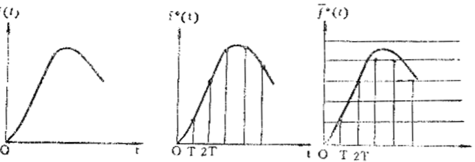

  正量过程所造成的误差就是 **量化误差**，表示为 $e=f^*(t)-\bar f(t)$，正量过程有两种处理方法：

  - **只舍不入**

    这种正量过程，量化误差只有正值，且等概率地取 $(0,q)$ 区间上的随机变量，误差的期望值
    $$
    \langle E\rangle=\int_0^qe\cdot p(e){\rm d}e=\frac q2
    $$
    其中，$p(e)=\frac1q$ 位 概率密度函数，进一步，方差为
    $$
    \sigma^2=\int_0^q(e-\langle E\rangle)^2p(e){\rm d}e=\frac{q^2}{12}
    $$

    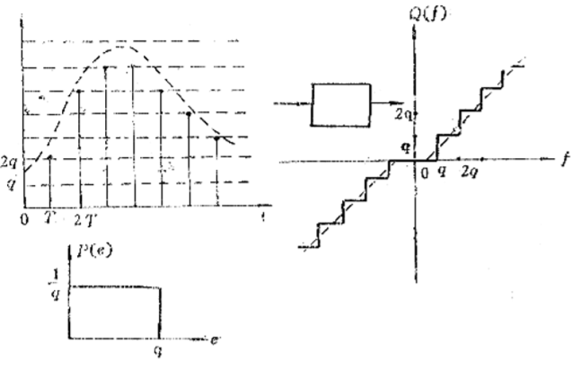

  - **有舍有入**

    这种正量过程采用四舍五入的方式，量化误差有正有负，且在 $(-\frac q2,\frac q2)$ 区间等概率取值。误差的期望值为零，方差同上，也为 $\frac{q^2}{12}$。

    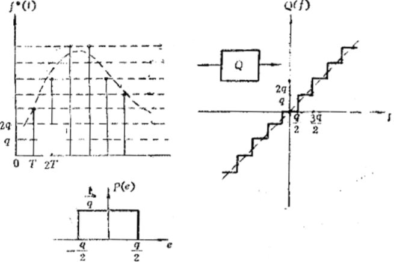

采用 **抗量化措施**，例如把量化剩余量寄存起来，累计到一个量化值时即时进入，可以有效减小量化误差。

#### 不可交换误差

直接按照陀螺仪输出的增量角计算转动的变换矩阵，具有不可交换误差。由于转动操作不可交换，不能按照矢量的合成和分解方法处理，因此，按照固定增量法求出的变换矩阵存在明显的误差，称之为 **不可交换误差**。减小不可交换误差的方法从根本上，只有减小采样的角增量，即增大采样频率，使 $\Delta \theta$ 平方以上各项小到可以完全忽略，但同时又增加了计算机的负担。

#### 截断误差

在计算机上计算的各种近似算法，本质上都是将无穷级数截断到有限项，这样造成了截断误差。在采样频率高时，一般使用低阶算法，低频采样时用高阶算法。

#### 舍入误差

### 方向余弦法的计算误差分析

#### 误差评价函数

用 $\boldsymbol C$ 表示理想的变换矩阵，用 $\boldsymbol{\hat C}$ 表示实际计算时用的变换矩阵（省略掉上下标），理想和计算的矩阵差值为：$\Delta\boldsymbol C=\boldsymbol C-\boldsymbol{\hat C}$。取 $\Delta\boldsymbol C$ 的 **范数** 作为评价函数，则
$$
||\Delta\boldsymbol C||=\sqrt{{\rm Tr}[(\Delta\boldsymbol C)^T(\Delta\boldsymbol C)]}
$$
表示 $\boldsymbol{\hat C}=\boldsymbol C(I+\boldsymbol{E})$，则上式为
$$
||\Delta\boldsymbol C||=\sqrt{{\rm Tr}(\boldsymbol{E^TE})}
$$
用 $\boldsymbol E$ 可以表示计算的变换矩阵偏离理想矩阵的程度，用 $e_{ij}$ 表示其中各个元素。**已知：任意一个矩阵，可以分解成一个对称矩阵和一个反对称矩阵的和**，即
$$
\boldsymbol E=\boldsymbol S_D+\boldsymbol V_D
$$

$$
\boldsymbol S_D=
\begin{pmatrix}
e_{11} & S_3 & S_2 \\
S_3 & e_{22} & S_1 \\
S_2 & S_1 & e_{33}
\end{pmatrix}
\quad
\boldsymbol V_D=
\begin{pmatrix}
0 & -V_3 & V_2 \\
V_3 & 0 & -V_1 \\
-V_2 & V_1 & 0
\end{pmatrix}
$$

$$
S_k=\frac12(e_{ij}+e_{ji}), \qquad k\neq i,j\\
V_k=\frac12(e_{ij}-e_{ji}), \qquad k=1,2,3 \neq i,j;\ i,j=3,2,1
$$

其中，$\boldsymbol S_D$ 是对称矩阵，$\boldsymbol V_D$ 是反对称矩阵。

#### 计算误差分析

两个正交坐标系之间的变换矩阵是正交矩阵，正交矩阵的列矢量（或行矢量）**正交归一**。

对于有误差的计算矩阵 $\boldsymbol{\hat C}$，
$$
\boldsymbol{\hat C}^T\boldsymbol{\hat C}=\boldsymbol{(I+E^T)C^TC(I+E)}=I+2\boldsymbol S_D
$$
 说明 $\boldsymbol{\hat C}$ 已经不是正交矩阵了，因此，用
$$
\boldsymbol S_D=\frac12(\boldsymbol{\hat C^T\hat C}-I)
$$
表示非正交误差，描述有计算矩阵有多大的非正交性。根据上式，$\boldsymbol S_D$ 的各个矩阵元都能计算出来。$e_{11},e_{22},e_{33}$ 为矢量长度的改变误差，即 **刻度误差**；$S_1,S_2,S_3$ 为 **不对称误差** 或者 **扭斜误差**，指一组正交矢量经过变换后不再式正交矢量。

再求 $\boldsymbol C$ 的转置和 $\boldsymbol{\hat C}$  相乘，
$$
\boldsymbol{C^T\hat C}=\boldsymbol{C^TC(I+E)}=\boldsymbol{I+S_D+V_D}
$$
在 $\boldsymbol{\hat C}$ **经过正交化处理的情况下**，$\boldsymbol S_D=0$，则
$$
\boldsymbol{C^T\hat C}=\boldsymbol{C^TC(I+E)}=\boldsymbol{I+V_D}\\
\boldsymbol V_D=\boldsymbol{C^T\hat C}-I
$$
称作 **漂移误差**。相当于被变换后坐标轴向的三个矢量相对于变换前的三个矢量分别绕三个坐标轴转动了一个小角度。

### 四元数法的计算误差分析

## 误差的基本特性

### 数学平台的误差方程

### 速度误差方程

### 位置误差方程

### 系统误差方程

$$
\boldsymbol X(t)=[\phi_N, \phi_E, \phi_D, \delta v_N, \delta v_E, \delta\varphi, \delta\lambda]^T\\
\boldsymbol B(t)=[-\epsilon_N, -\epsilon_E, -\epsilon_D, \nabla_N, \nabla_E, 0, 0]^T\\
\boldsymbol{\dot X}(t)=\boldsymbol{F}(t)\boldsymbol{X}(t)+\boldsymbol{B}(t)
$$

### 误差传播特性

## 随机误差源引起的系统误差

### 陀螺漂移的误差模型

### 加速度表随机误差模型

### 系统状态方程和均方差分析

### 计算举例

# 方向余弦矩阵的正交化和四元数矩阵的规范化

## 方向余弦矩阵的最优正交化

用 $\boldsymbol{\hat C}$ 表示计算的方向余弦矩阵，$\boldsymbol{C_0}$ 表示正交化后的方向余弦矩阵，如果有
$$
||\boldsymbol{C_0}-\boldsymbol{\hat C}||=||\boldsymbol{C_0}-\boldsymbol{\hat C}||_{\rm min}\quad
或者\quad||\boldsymbol{C_0}-\boldsymbol{\hat C}||^2=||\boldsymbol{C_0}-\boldsymbol{\hat C}||^2_{\rm min}
$$
则称 $\boldsymbol{C_0}$ 是 $\boldsymbol{\hat C}$ 的最优正交化矩阵。
$$
||\boldsymbol{C_0}-\boldsymbol{\hat C}||=\sqrt{\rm{Tr}[(\boldsymbol{C_0-\hat C})^T(\boldsymbol{C_0-\hat C})]}\\
||\boldsymbol{C_0}-\boldsymbol{\hat C}||^2=\rm{Tr}[(\boldsymbol{C_0-\hat C})^T(\boldsymbol{C_0-\hat C})]
$$
正交条件：
$$
\boldsymbol{C_0^TC_0}=I
$$

### 方向余弦矩阵最优正交化的精确解

#### 导函数求极小值法

标量函数 $N=||\boldsymbol{C_0}-\boldsymbol{\hat C}||=\sqrt{\rm{Tr}[(\boldsymbol{C_0-\hat C})^T(\boldsymbol{C_0-\hat C})]}$， 以 $\boldsymbol{C_0}$ 为变量，对其求导并令为零，结果为
$$
\boldsymbol{C_0}|_{N=N_{\rm min}}=(\boldsymbol{\hat C\hat C^T})^{\frac12}(\boldsymbol{\hat C^T})^{-1}
$$

#### 矩阵的极分解法

##### 矩阵极分解的概念

**定理：**

- 一个满秩矩阵可以唯一地分解为一个正定矩阵和一个正交矩阵的乘积；

- 设 $\boldsymbol{{\rm{M}}_r}$ 是一组 $r\times r$ 阶正交矩阵的集合，$\forall A_r$， $A_r=\widetilde UR$，其中，$\widetilde U\in\boldsymbol{{\rm{M}}_r}$，$R$ 为实正定矩阵，并且，$\forall Q\in\boldsymbol{{\rm{M}}_r}$，有
  $$
  ||\widetilde U-A||_E<||Q-A||_E
  $$

把以上两个定理应用到矩阵正交化，同样会得到$(41)$式。

#### 方向余弦矩阵最优正交化的级数解

在精确解中有对矩阵开方的操作，这在计算机中是非常麻烦的，为了避免矩阵开方，通常都是采用近似级数解。
$$
\boldsymbol{C_0}=[I+\frac12\widetilde E-\frac1{2\cdot4}\widetilde E^2+\frac{1\cdot3}{2\cdot4\cdot6}\widetilde E^3+\cdots](\boldsymbol{\hat C^T})^{-1}
$$
在实际操作中，取三项就够了。

#### 迭代法

把 $\hat C$ 看作初始值用 $X_n$ 表示，$C_0$ 作为一步迭代值用 $X_{n+1}$ 表示，则
$$
X_{n+1}=[I+\frac12(X_nX_n^T-I)](X_n^T)^{-1}\\
X_{n+1}=\frac12[(X_n^T)^{-1}+X_n]
$$

### 矩阵正交化的评价

#### 误差函数

$$
e_n=||E||^2=\sum_{i=1}^3\sum_{j=1}^3{e_n^2}_{i,j}\\
E_n=X_n^TX_n-I
$$

误差函数定义为正交化后的矩阵偏离正交矩阵的误差范数，如果正交化后的矩阵是一个正交矩阵，则 $e_n=0$。

#### 测距函数

最优正交化就是正交化后的矩阵最接近原来的矩阵，测距函数就是来评价其接近的程度，定义为
$$
d=||C_n-\hat C||^2=\sum_{i=1}^3\sum_{j=1}^3({{C_n}_{i,j}}-\hat C_{i,j})^2
$$
如果采用迭代法进行正交化，$n$ 表示迭代次数。

## 变换四元数的规范化

和方向余弦矩阵的情况类似，由于计算方法上的截断误差和计算机的舍入误差，使计算的变换四元数的范数不再等于1，即四元数失去规范性，从而出现 **刻度误差**，因此要对其做 **规范化处理** 以消除刻度误差。

用 $\hat Q$ 表示计算的变换四元数，$Q$ 表示理想的变换四元数
$$
\hat Q=\hat q_0+\hat q_1\bold{i}+\hat q_2\bold{j}+\hat q_3\bold{k}\\
Q=q_0+q_1\bold{i}+q_2\bold{j}+q_3\bold{k}
$$
用最小二乘法求最优规范化的变换四元数，即
$$
D^2=\sum_{i=0}^3(\hat q_i-q_i)^2
$$
在约束条件 $g=\sum_{i-1}^3\hat q_i^2-1=0$ 下的拉格朗日未定乘子法方程为
$$
\phi=D^2+\lambda g
$$
对其求导并令为零，最终求得最优化四元素
$$
q_i=\frac{\hat q_i}{\sqrt{\hat q_0^2+\hat q_1^2+\hat q_2^2+\hat q_3^2}}
$$
